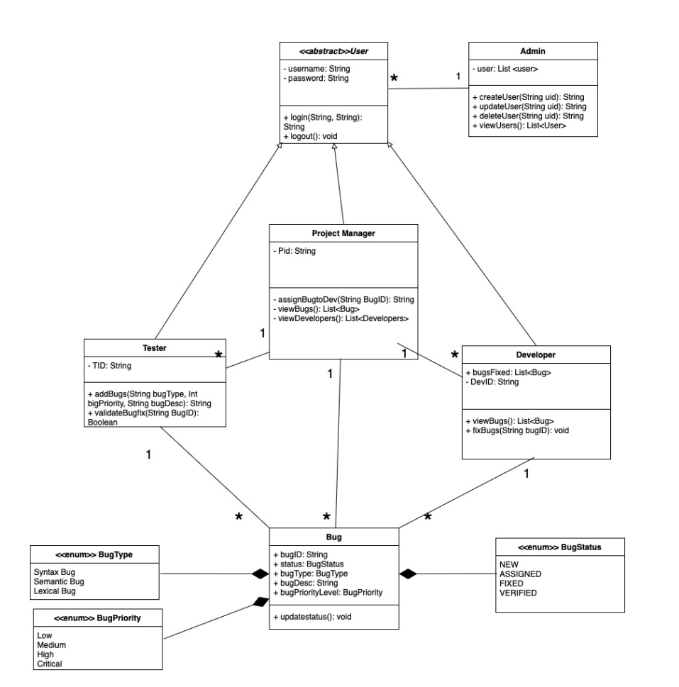

# 🐞 Bug Management System

A **full-stack web application** for efficient **bug tracking and project management**, built to streamline the software development lifecycle. This system allows role-based interaction between **Admins**, **Project Managers**, and **Developers**, ensuring clear responsibilities and effective collaboration.

---

## 🔧 Features

### 🛡️ Role-Based Access Control

* **Admins**: Manage users and projects.
* **Project Managers**: Create, assign, and manage bugs within their projects.
* **Developers**: View and update bugs assigned to them.

### 📋 Bug Reporting & Tracking

* Report bugs with **priority**, **severity**, and **detailed descriptions**.
* Update bug status: `Open`, `In Progress`, `Resolved`, `Closed`.
* Assign bugs to specific team members.

### 🗂️ Project Management

* Create and manage multiple projects.
* Assign users to projects with specific roles.

### 🧑‍💻 User Management

* Secure **login system** with **session-based authentication**.
* Admin dashboard for managing users (add/edit/delete).

### 🖥️ Interactive Dashboards

* Clean, user-friendly UI using **EJS templates** and **Bootstrap**.
* Personalized views based on user role and project association.

---

## 🛠️ Tech Stack

* **Frontend**: EJS, Bootstrap, HTML/CSS
* **Backend**: Node.js, Express.js
* **Database**: MongoDB
* **Authentication**: express-session, bcrypt

---

## 🚀 Getting Started

### 1. Clone the Repository

```bash
git clone https://github.com/Aldrin-Rodrigues/Bug-Management-System.git
cd Bug-Management-System
```

### 2. Install Dependencies

```bash
npm install
```

### 3. Setup MongoDB

Ensure MongoDB is installed and running on your machine.

Create a `.env` file in the root directory and add:

```env
MONGODB_URI=mongodb://localhost:27017/bug-management
SESSION_SECRET=your_secret_key
```

### 4. Run the Application

```bash
npm start
```

Visit [http://localhost:3000](http://localhost:3000) in your browser to get started.

---

## 📸 Screenshots




---

## 👥 Contributors

* Aldrin Rodrigues
* Aritro Maiti
* Ankit Arjunagi
* Amaan Ahmed

---

## 📄 License

This project is licensed under the **MIT License** – see the [LICENSE](LICENSE) file for details.

